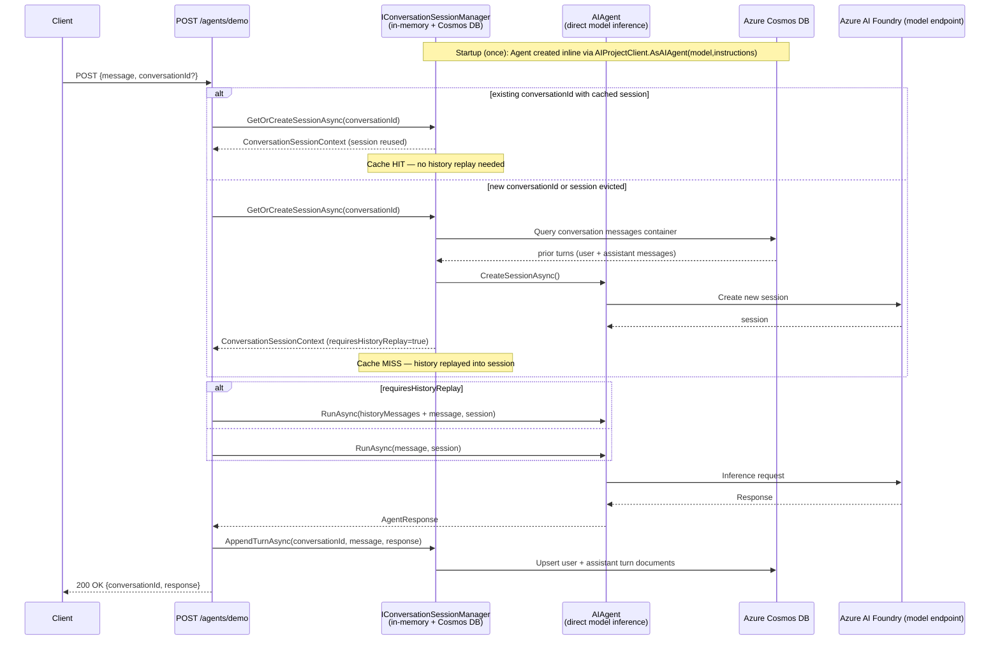
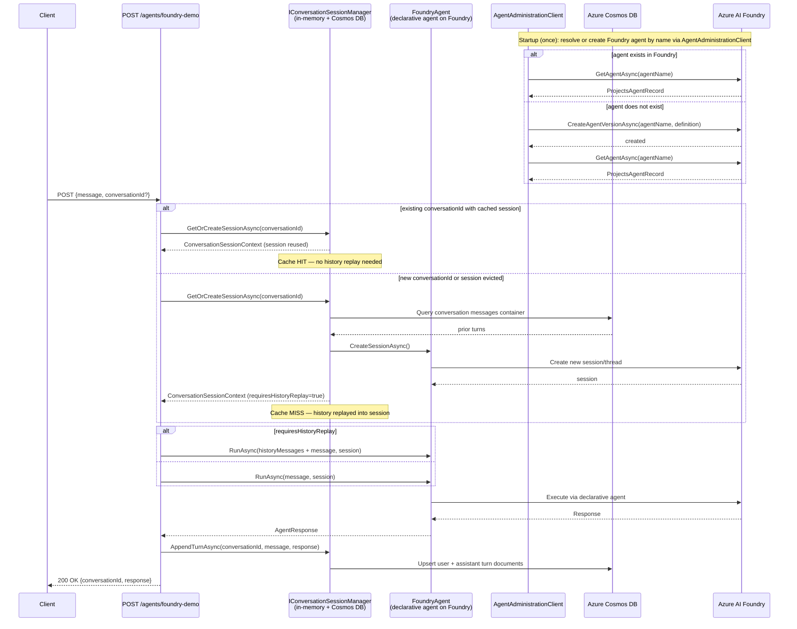
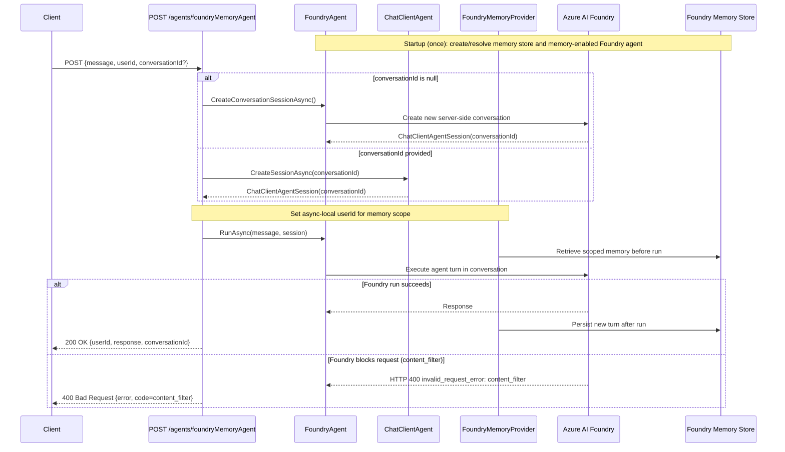

# Agent Hub — Sequence Diagrams

## 1. `/agents/demo` — Direct Model Inference with Cosmos DB Memory



---

## 2. `/agents/foundry-demo` — Foundry-Managed Agent with Cosmos DB Memory



---

## 3. `/agents/foundryMemoryAgent` — Foundry Memory Provider with Conversation Resume



---

## 4. Event Charter UI — KAI Intents over `/agents/foundryMemoryAgent`

The `event-charter.html` SPA (served as the home page) drives the same memory agent endpoint
with a structured JSON envelope. The `intent` field tells the system prompt how to format
its reply. The UI keeps two independent threads: one for per-field interactions
(`field_help` / `review` / `section_review`) and one for the Chat tab.

```mermaid
sequenceDiagram
    participant User
    participant UI as event-charter.html<br/>(React SPA)
    participant Route as POST /agents/foundryMemoryAgent
    participant Memory as FoundryMemoryAgent<br/>(KAI system prompt)
    participant Foundry as Azure AI Foundry

    Note over UI: Two conversation threads kept locally:<br/>• fieldConvId (Ask AI, Review, Section Review)<br/>• chatConvId (Chat tab)

    alt User clicks ✨ Ask AI on a field
        User->>UI: Click "✨ Ask AI" on <field>
        UI->>UI: buildFieldPrompt(section, field, values)<br/>→ {intent:"field_help", section, field, currentValue, sectionValues}
        UI->>Route: POST {userId, message:<json>, conversationId:fieldConvId}
        Route->>Memory: ProcessMessage(...)
        Memory->>Foundry: RunAsync(envelope) with KAI instructions
        Foundry-->>Memory: Markdown: tips bullets + "> Suggested wording"
        Memory-->>Route: {response, conversationId}
        Route-->>UI: 200 OK
        UI->>UI: extractSuggestions(markdown)<br/>render Suggestions panel
        User->>UI: Click "Use this" on Suggested wording
        UI->>UI: handleFieldChange(fieldId, primary text)
        Note over UI: Field value updated → progress %<br/>and chips recomputed live
    end

    alt User clicks 💡 Review (e.g. Problem Statement)
        User->>UI: Click "💡 Review" on <field>
        UI->>UI: buildReviewPrompt(...)<br/>→ {intent:"review", ...}
        UI->>Route: POST {..., conversationId:fieldConvId}
        Memory->>Foundry: RunAsync(envelope)
        Foundry-->>Memory: Rubric (✅/❌/⚠️) + revised "> Suggested wording"
        Memory-->>UI: 200 OK
        UI->>User: Show rubric + "Use this" to apply revised wording
    end

    alt User clicks ✨ Suggest tips for <section>
        User->>UI: Click section-level Suggest button
        UI->>UI: buildSectionPrompt(...)<br/>→ {intent:"section_review", field:null, ...}
        UI->>Route: POST {..., conversationId:fieldConvId}
        Foundry-->>Memory: Section critique markdown
        Memory-->>UI: 200 OK
        UI->>User: Render critique (no per-field "Use this")
    end

    alt User uses 💬 Chat tab
        User->>UI: Type message, press Enter
        UI->>UI: buildChatPrompt(section, values, userText)<br/>→ {intent:"chat", userMessage:userText, ...}
        UI->>Route: POST {..., conversationId:chatConvId}
        Memory->>Foundry: RunAsync(envelope)
        Foundry-->>Memory: 1–3 paragraphs of plain prose<br/>(no rubric, no Suggested wording)
        Memory-->>UI: 200 OK
        UI->>User: Append assistant bubble to chat history
    end

    Note over UI,Memory: First response on each thread sets that thread's<br/>conversationId; subsequent calls reuse it so Foundry<br/>memory + thread context are preserved per intent group.
```
