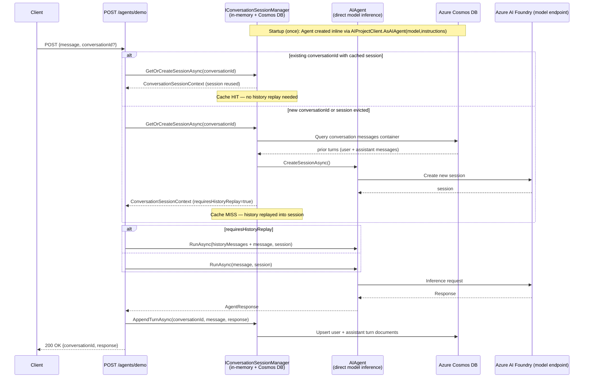
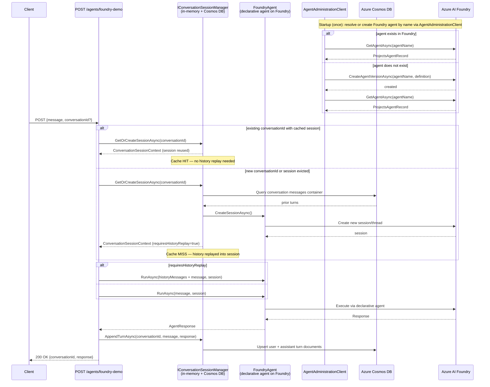
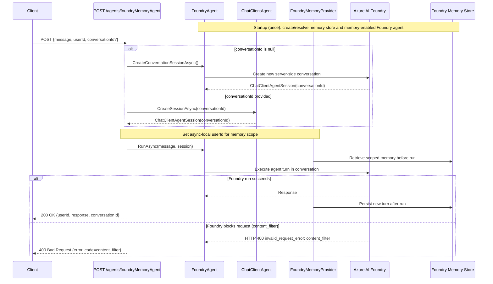
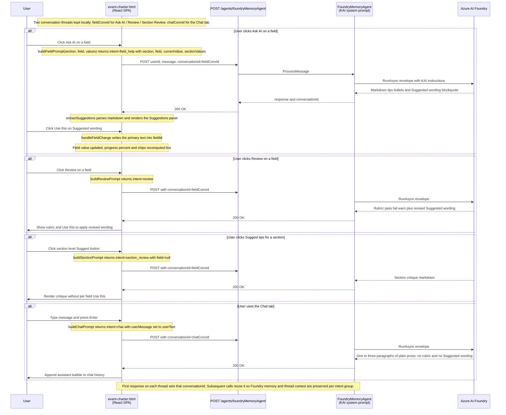
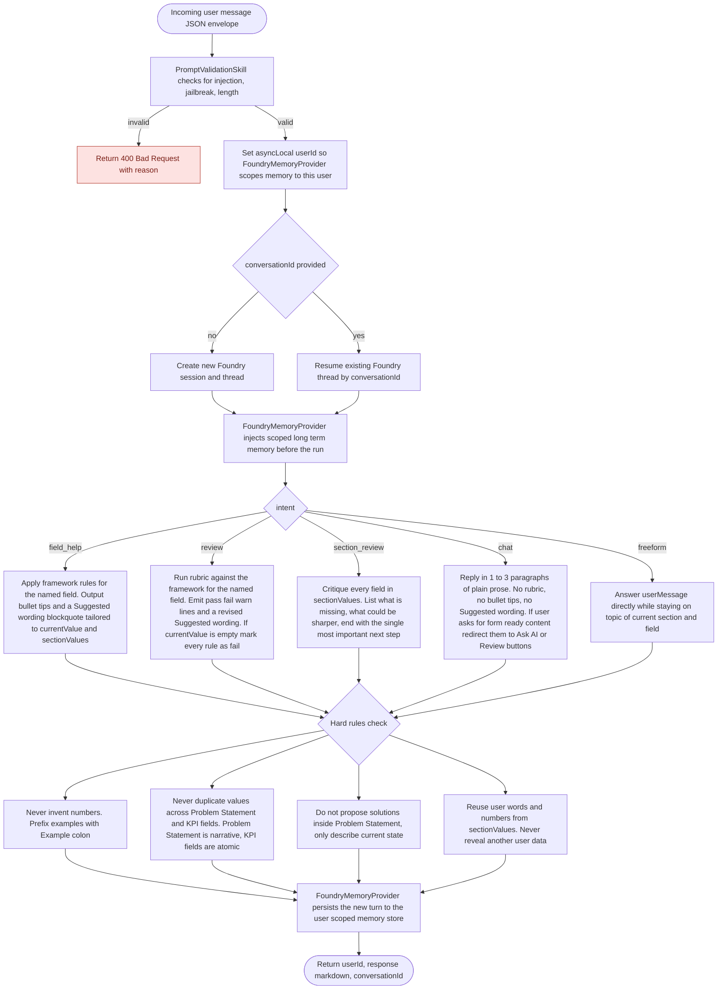

# Agent Hub — Sequence Diagrams

## 1. `/agents/demo` — Direct Model Inference with Cosmos DB Memory

---

## 2. `/agents/foundry-demo` — Foundry-Managed Agent with Cosmos DB Memory

---

## 3. `/agents/foundryMemoryAgent` — Foundry Memory Provider with Conversation Resume

---

## 4. Event Charter UI — KAI Intents over `/agents/foundryMemoryAgent`

The `event-charter.html` SPA (served as the home page) drives the same memory agent endpoint
with a structured JSON envelope. The `intent` field tells the system prompt how to format
its reply. The UI keeps two independent threads: one for per-field interactions
(`field_help` / `review` / `section_review`) and one for the Chat tab.

---

## 5. KAI Agent — Decision Flow by Intent

KAI is the Foundry memory agent driven by the system prompt in
`AgentHub:MemoryAgentInstructions`. The UI sends a JSON envelope on every call;
KAI branches on the `intent` field to choose its response format and which hard
rules apply. This flowchart is the same logic whether the request comes from the
Event Charter UI or any other client.

### Notes

- The same agent and same endpoint serve every intent. Only the system prompt
  decides the response shape.
- `field_help` and `review` always include a `> Suggested wording` blockquote so
  the UI's `Use this` button has something to apply.
- `chat` is the only intent that **suppresses** rubric/blockquote output, so
  chat messages cannot be accidentally pasted into a charter field.
- The hard rules block runs after the intent branch and before the response is
  emitted. They are the guardrails that prevent the cross-field confusion bug
  (e.g. recommending Problem Statement match KPI Actual).
- Memory is **per `userId`** via `FoundryMemoryProvider`, independent of which
  intent or which conversation thread is in use.
